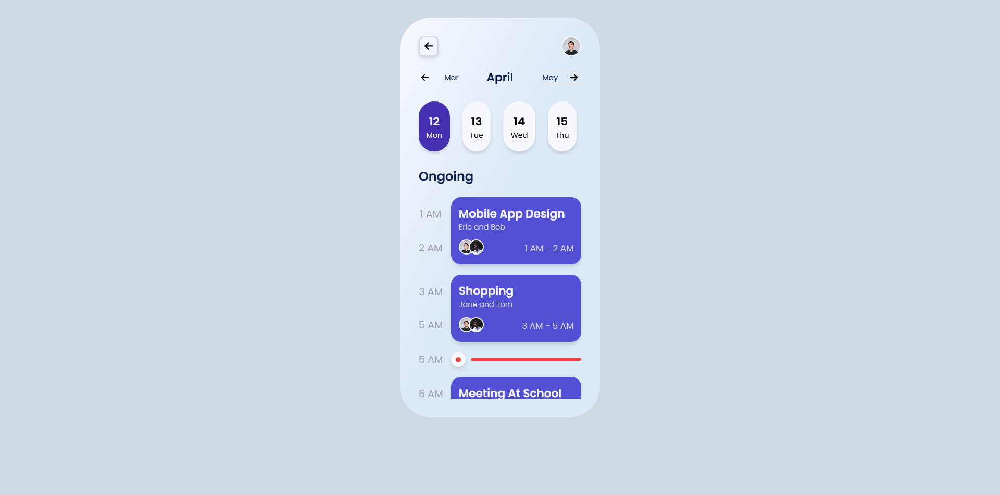

<<<<<<< HEAD
 ## My Web Site

=======
Simple mobile UI theme for task Scheduling application done using react and tailwind css. Inspired by dribble design themes

### 

# Screenshots
<table width="100%" height="100%">

<tr>

</tr>

<tr>
    

</tr>
<tr>
    

</tr>

</table>
>>>>>>> refs/remotes/origin/master
